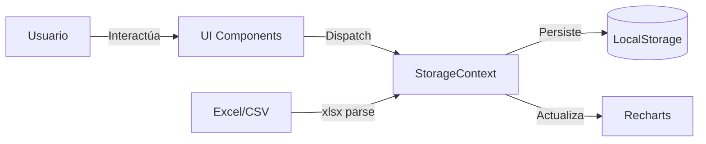

<div align="center">

# 🏠 Dashboard de Facturas del Hogar

**Toma el control de tus finanzas domésticas con estilo**

[](https://base-project-inky.vercel.app)
[](https://react.dev)
[](https://typescriptlang.org)
[](https://tailwindcss.com)

<br />


</div>

---

## 📋 Tabla de Contenidos

- [El Problema](#-el-problema)
- [La Solución](#-la-solución)
- [Funcionalidades](#-funcionalidades)
- [Demo](#-demo)
- [Tech Stack](#-tech-stack)
- [Instalación](#-instalación)
- [Arquitectura](#-arquitectura)
- [Decisiones Técnicas](#-decisiones-técnicas)
- [Autor](#-autor)

---

## 🎯 El Problema

Las herramientas tradicionales de finanzas personales son:

- **Fragmentadas:** Recibos físicos, apps bancarias desconectadas, hojas de Excel
- **Complejas:** Curva de aprendizaje alta para funciones básicas
- **Invasivas:** Requieren conexión a cuentas bancarias o suscripciones costosas

> *"Solo quería saber en qué estoy gastando mi dinero sin entregar mis datos financieros a terceros."*

---

## 💡 La Solución

Una aplicación web **privada**, **rápida** y **visual** que:

✅ Funciona 100% en tu navegador (tus datos nunca salen de tu dispositivo)  
✅ Permite ingreso manual y carga masiva desde Excel/CSV  
✅ Visualiza patrones de gasto con gráficos intuitivos  
✅ Alerta cuando te acercas o superas tu presupuesto  
✅ Proyecta tu gasto al cierre del mes  

---

## ✨ Funcionalidades

<table>
<tr>
<td width="50%">

### 📊 Dashboard Inteligente
- Resumen de gastos en tiempo real
- Gráfico circular por categorías
- Tendencia mensual de gastos
- Comparativo mes a mes

</td>
<td width="50%">

### 💰 Sistema de Presupuestos
- Presupuesto global y por categoría
- Alertas visuales al 80% y 100%
- Proyección de cierre de mes
- Indicador de ritmo de gasto

</td>
</tr>
<tr>
<td width="50%">

### 📁 Importación Inteligente
- Carga archivos Excel/CSV
- Normalización automática de datos
- Auto-categorización de gastos nuevos
- Validación de tipos de datos

</td>
<td width="50%">

### 🎨 Experiencia de Usuario
- Diseño Pixel Art único
- Modo oscuro/claro
- 100% Responsive
- Categorías personalizables con colores

</td>
</tr>
</table>

---

## 🎬 Demo

<div align="center">

### Vista Principal


### Importación de Datos


</div>

> 🔗 **[Ver Demo en Vivo](https://base-project-inky.vercel.app)**

---

## 🛠 Tech Stack

| Categoría | Tecnología | Justificación |
|-----------|------------|---------------|
| **Framework** | React 19 | Componentes funcionales, hooks modernos |
| **Lenguaje** | TypeScript | Tipado estático para robustez |
| **Estilos** | Tailwind CSS 4 | Utility-first, tema personalizado |
| **Build** | Vite | HMR rápido, bundle optimizado |
| **Gráficos** | Recharts | Declarativo, integración nativa con React |
| **Archivos** | xlsx | Parsing de Excel en cliente |
| **Iconos** | Lucide React | Ligero, consistente |
| **Deploy** | Vercel | CI/CD automático, edge network |

---

## 🚀 Instalación

```bash
# Clonar repositorio
git clone https://github.com/tu-usuario/dashboard-facturas-hogar.git

# Entrar al directorio
cd dashboard-facturas-hogar

# Instalar dependencias
npm install

# Iniciar servidor de desarrollo
npm run dev

# Build para producción
npm run build
```

---

## 🏗 Arquitectura

```
src/
├── components/
│   ├── Dashboard/          # Panel principal y métricas
│   ├── Charts/             # Gráficos (Pie, Line, Bar)
│   ├── ExpenseForm/        # Formulario de ingreso
│   ├── ImportTool/         # Motor de importación
│   └── Settings/           # Configuración y categorías
├── contexts/
│   └── StorageContext.tsx  # Estado global + persistencia
├── hooks/
│   └── useExpenses.ts      # Lógica de gastos
├── types/
│   └── index.ts            # Interfaces TypeScript
├── utils/
│   ├── calculations.ts     # Proyecciones y totales
│   └── normalizers.ts      # Limpieza de datos
└── App.tsx
```

### Flujo de Datos



---

## 🧠 Decisiones Técnicas

### ¿Por qué LocalStorage?

| Pros | Contras |
|------|---------|
| ✅ Privacidad total | ⚠️ Límite ~5MB |
| ✅ Sin costos de servidor | ⚠️ Sin sincronización |
| ✅ Funciona offline | ⚠️ Datos en un solo dispositivo |
| ✅ Latencia cero | |

> **Decisión:** Para un MVP enfocado en privacidad, localStorage es suficiente. El roadmap incluye migración opcional a Supabase.

### ¿Por qué Pixel Art?

Las apps financieras suelen ser aburridas y corporativas. El estilo Pixel Art:
- Reduce la fricción emocional de revisar gastos
- Diferencia el producto en el mercado
- Demuestra capacidad de personalización de UI

---

## 📈 Métricas

| Métrica | Valor |
|---------|-------|
| Lighthouse Performance | 95+ |
| Lighthouse Accessibility | 100 |
| Bundle Size (gzipped) | ~85kb |
| Time to Interactive | <1.5s |

---

## 🤝 Contribuir

Las contribuciones son bienvenidas. Por favor:

1. Fork el proyecto
2. Crea tu rama (`git checkout -b feature/nueva-funcionalidad`)
3. Commit tus cambios (`git commit -m 'Add: nueva funcionalidad'`)
4. Push a la rama (`git push origin feature/nueva-funcionalidad`)
5. Abre un Pull Request

---

## 👨‍💻 Autor

<div align="center">

**[Tu Nombre]**

[](https://linkedin.com/in/tu-perfil)
[](https://github.com/tu-usuario)
[](https://tu-portfolio.com)

</div>

---

<div align="center">

**¿Te fue útil este proyecto?**

⭐ Dale una estrella si te gustó

</div>
